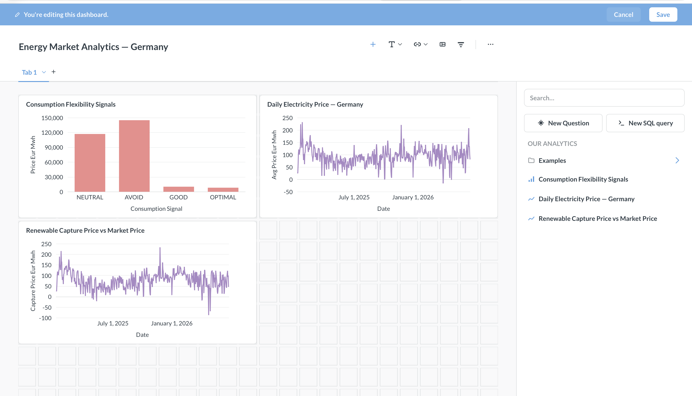
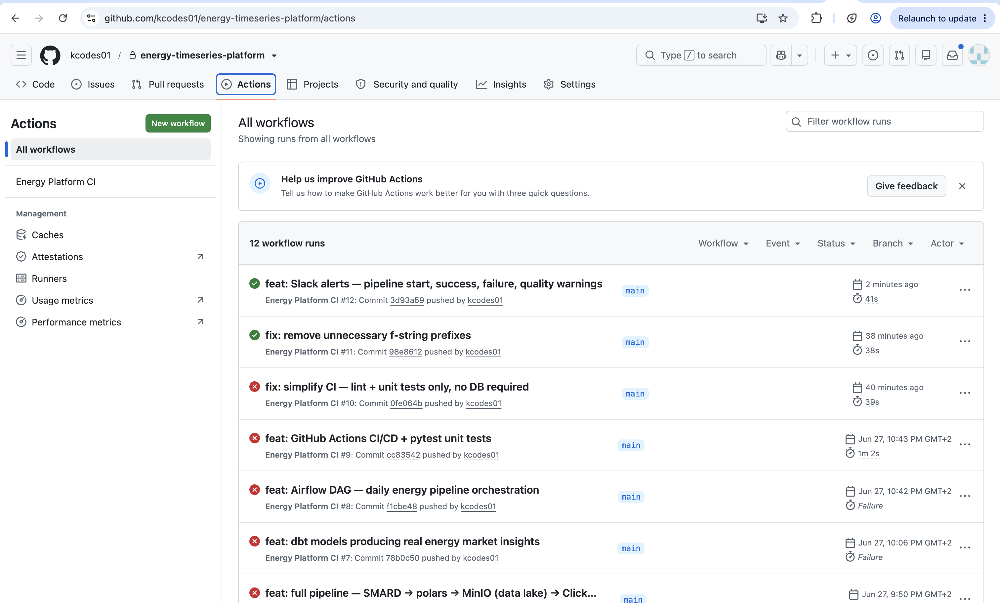
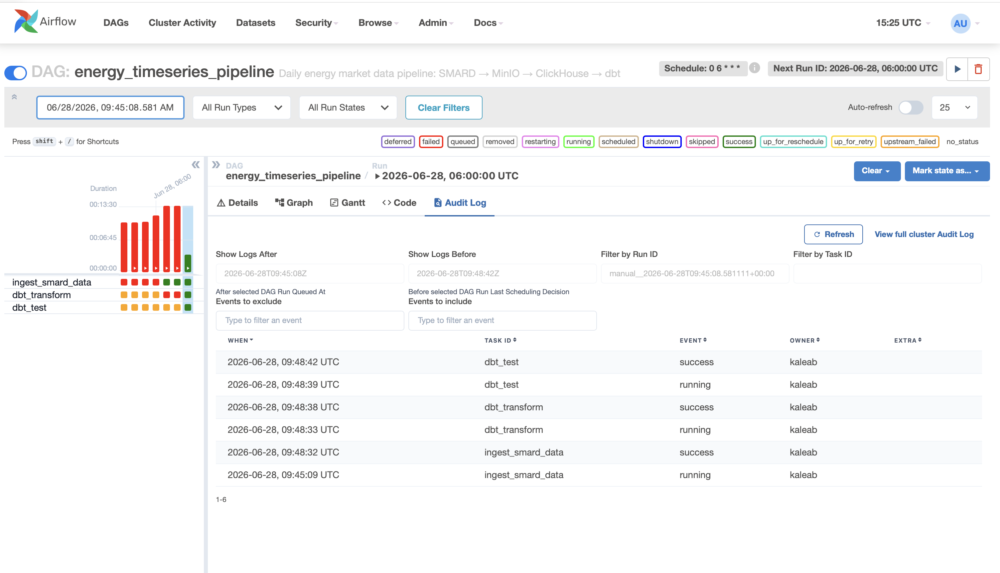

# ⚡ Energy Timeseries Platform

> End-to-end time-series data platform for energy market analytics — from raw SMARD data ingestion to business-ready insights on renewable generation and price volatility.


---

## 📊 Dashboard



---

## 🏗️ Architecture
SMARD API (German Energy Market Data)

↓

Python + polars

(normalization + quality checks)

↓

dlt

↓                    ↓

MinIO                ClickHouse

(Data Lake)             (Warehouse)

Parquet files           Raw tables

↓

dbt

(staging → intermediate → marts)

↓

Metabase

(dashboards)

↓

Airflow

(daily orchestration @ 6am)

↓

Slack

(alerts & monitoring)

---

## 🗺️ Local ↔ Production Mapping

| Component | Local Demo | Production |
|---|---|---|
| Data Lake | MinIO (S3-compatible) | AWS S3 |
| Warehouse | ClickHouse (Docker) | ClickHouse (Cloud) |
| Ingestion | dlt | dlt |
| Processing | polars | polars |
| Transform | dbt | dbt |
| Orchestration | Airflow (Docker) | Airflow |
| BI | Metabase (Docker) | Metabase |
| Monitoring | Slack webhooks | Slack webhooks |

> Switching from local to production is a credentials swap only — no code changes needed.

---

## 📡 Data Sources

10 SMARD filters — Jan 2025 to present — hourly resolution — **129,350 rows**:

| Category | Filter | ID |
|---|---|---|
| Price | Market price: Germany/Luxembourg | 4169 |
| Price | Market price: Austria | 4170 |
| Generation | Onshore wind | 4067 |
| Generation | Solar/Photovoltaics | 4068 |
| Generation | Offshore wind | 1225 |
| Generation | Natural gas | 4071 |
| Consumption | Total grid load | 410 |
| Consumption | Residual load | 4359 |
| Forecast | Wind + solar combined | 5097 |
| Forecast | Total production | 122 |

---

## 🔄 dbt Models
staging/

└── stg_energy_timeseries          ← clean types, derived time columns
intermediate/

├── int_hourly_prices               ← hourly price aggregations

├── int_renewable_generation        ← wind + solar breakdown

└── int_residual_load               ← demand minus renewables
marts/

├── mart_daily_price_summary        ← daily stats + negative price hours

├── mart_capture_prices             ← weighted avg price during renewable production

└── mart_flexibility_signals        ← OPTIMAL/GOOD/NEUTRAL/AVOID signals

---

## 🚀 CI/CD



---

## ⏱️ Airflow Orchestration



Daily pipeline runs at **6am UTC**:
1. `ingest_smard_data` — fetch SMARD → polars → MinIO + ClickHouse
2. `dbt_transform` — run all 7 dbt models
3. `dbt_test` — validate data quality

---

## 🔔 Slack Monitoring

Real-time alerts for:
- 🚀 Pipeline started
- ✅ Pipeline completed (with row count + duration)
- 🔴 Pipeline failed (with error details)
- ⚠️ Data quality warnings

---

## 🛠️ Stack

| Layer | Tool | Version |
|---|---|---|
| Ingestion | dlt | 1.28 |
| Processing | polars | 0.20 |
| Data Lake | MinIO | Latest |
| Warehouse | ClickHouse | 26.5 |
| Transformation | dbt-clickhouse | 1.7 |
| Orchestration | Apache Airflow | 2.9 |
| BI | Metabase | Latest |
| Infrastructure | Docker Compose | - |
| CI/CD | GitHub Actions | - |
| Language | Python | 3.11 |

---

## ⚡ Quick Start

```bash
# Clone
git clone https://github.com/kcodes01/energy-timeseries-platform.git
cd energy-timeseries-platform

# Start all services
docker-compose up -d

# Create virtual environment
python -m venv venv
source venv/bin/activate
pip install -r requirements.txt

# Create MinIO bucket
python3 -c "
from minio import Minio
client = Minio('localhost:9000', access_key='minioadmin', secret_key='minioadmin', secure=False)
client.make_bucket('trawa-energy-lake')
print('✅ Bucket created')
"

# Set ClickHouse credentials
export DESTINATION__CLICKHOUSE__CREDENTIALS__USERNAME=default
export DESTINATION__CLICKHOUSE__CREDENTIALS__PASSWORD=""
export DESTINATION__CLICKHOUSE__CREDENTIALS__HOST=localhost
export DESTINATION__CLICKHOUSE__CREDENTIALS__PORT=9002
export DESTINATION__CLICKHOUSE__CREDENTIALS__DATABASE=energy
export DESTINATION__CLICKHOUSE__CREDENTIALS__SECURE=0
export DESTINATION__CLICKHOUSE__CREDENTIALS__HTTP_PORT=8123

# Run pipeline
cd pipeline && python smard_pipeline.py

# Run dbt
cd ../dbt_project && dbt run && dbt test

# Open Metabase
open http://localhost:3000
```

---

## 🌐 Services

| Service | URL | Credentials |
|---|---|---|
| MinIO Console | http://localhost:9001 | minioadmin / minioadmin |
| Airflow | http://localhost:8080 | admin / admin123 |
| Metabase | http://localhost:3000 | set on first visit |
| ClickHouse HTTP | http://localhost:8123 | default / (empty) |

---

## 👤 Author

**Kaleab Ejigayehu Teka** — Data Engineer & Analytics Engineer, Berlin

[](https://www.linkedin.com/in/kaleab-ejigayehu-36941786/)
[](https://github.com/kcodes01)
