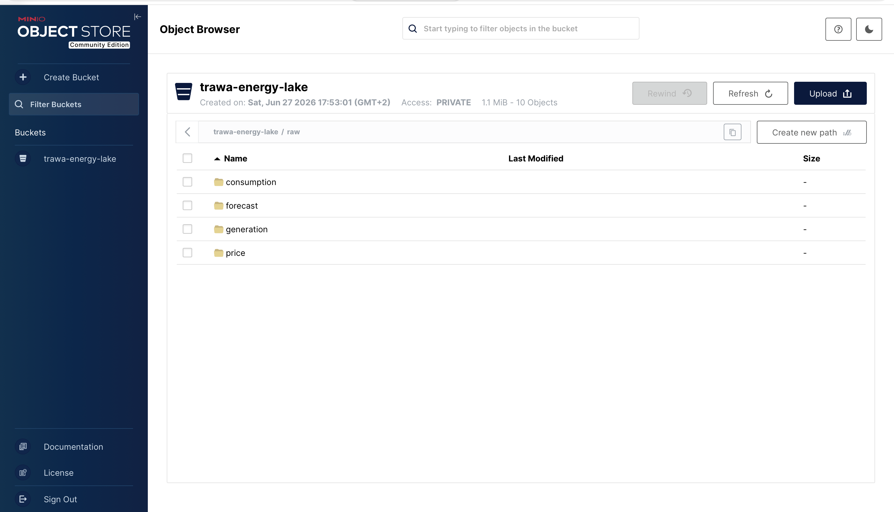

# ⚡ Energy Timeseries Platform

> End-to-end time-series data platform for energy market analytics — from raw SMARD API ingestion to business-ready insights on renewable generation, price volatility and flexibility signals.


---

## 📊 Dashboard — Energy Market Analytics Germany


---

## 🏗️ Architecture

```
┌─────────────────────────────────────────────────────────────┐
│                      DATA SOURCES                           │
│  SMARD API (Bundesnetzagentur — German Electricity Market)  │
│  • 10 filters: prices, generation, consumption, forecasts   │
│  • Hourly resolution • Jan 2025 → present • 129,350 rows   │
└──────────────────────────┬──────────────────────────────────┘
                           │
                           ▼
┌─────────────────────────────────────────────────────────────┐
│                   INGESTION LAYER                           │
│  Python + polars                                            │
│  • Fetch timestamps (Endpoint 1)                           │
│  • Filter chunks >= Jan 2025 (polars DataFrame ops)        │
│  • Fetch data chunks (Endpoint 2)                          │
│  • Normalize [timestamp, value] → clean DataFrame          │
│  • Quality checks: nulls, range, duplicates                │
└──────────────┬──────────────────────────┬───────────────────┘
               │ dlt                      │ dlt
               ▼                          ▼
┌──────────────────────┐    ┌─────────────────────────────────┐
│     DATA LAKE        │    │        DATA WAREHOUSE           │
│  MinIO (S3-compat.)  │    │  ClickHouse                     │
│  smard-energy-lake/  │    │  • Columnar time-series DB      │
│  raw/                │    │  • 129,350 rows                 │
│  ├── price/          │    │  • Sub-100ms queries            │
│  ├── generation/     │    │  • Schema auto-managed by dlt   │
│  ├── consumption/    │    │  • Incremental state tracking   │
│  └── forecast/       │    │                                 │
│  Parquet format      │    │                                 │
└──────────────────────┘    └────────────────┬────────────────┘
                                             │
                                             ▼
┌─────────────────────────────────────────────────────────────┐
│                TRANSFORMATION LAYER (dbt)                   │
│                                                             │
│  staging/                                                   │
│  └── stg_energy_timeseries    ← types, time columns        │
│                                                             │
│  intermediate/                                              │
│  ├── int_hourly_prices         ← hourly price aggregations │
│  ├── int_renewable_generation  ← wind + solar breakdown    │
│  └── int_residual_load         ← demand minus renewables   │
│                                                             │
│  marts/                                                     │
│  ├── mart_daily_price_summary  ← daily stats + neg. hours  │
│  ├── mart_capture_prices       ← weighted renewable price  │
│  └── mart_flexibility_signals  ← OPTIMAL/GOOD/NEUTRAL/AVOID│
└──────────────────────────────┬──────────────────────────────┘
                               │
                               ▼
┌─────────────────────────────────────────────────────────────┐
│                  PRESENTATION LAYER                         │
│  Metabase                                                   │
│  • Daily Electricity Price — Germany                        │
│  • Renewable Capture Price vs Market Price                  │
│  • Consumption Flexibility Signals                          │
└─────────────────────────────────────────────────────────────┘
                               │
                               ▼
┌─────────────────────────────────────────────────────────────┐
│              ORCHESTRATION & MONITORING                     │
│                                                             │
│  Airflow (daily @ 6am UTC)       Slack Alerts              │
│  ingest_smard_data               • 🚀 Pipeline started     │
│       ↓                          • ✅ Pipeline completed    │
│  dbt_transform                   • 🔴 Task failed          │
│       ↓                          • ⚠️  Quality warning      │
│  dbt_test                                                   │
└─────────────────────────────────────────────────────────────┘
```

---

## 🗺️ Local ↔ Production Mapping

| Component | Local Demo | Production |
|---|---|---|
| **Processing** | Python + polars | Python + polars |
| **Ingestion** | dlt 1.28 | dlt 1.28 |
| **Data Lake** | MinIO (S3-compatible) | AWS S3 |
| **Warehouse** | ClickHouse (Docker) | ClickHouse (Cloud) |
| **Transformation** | dbt-clickhouse | dbt-clickhouse |
| **Orchestration** | Airflow (Docker) | Airflow (Managed) |
| **BI** | Metabase (Docker) | Metabase (Cloud) |
| **Monitoring** | Slack webhooks | Slack webhooks |
| **CI/CD** | GitHub Actions | GitHub Actions |

> Switching from local to production requires only a credentials swap — no pipeline code changes needed.

---

## 📡 Data Sources — SMARD API

| Category | Filter Name | ID | Unit |
|---|---|---|---|
| 💰 Price | Market price: Germany/Luxembourg | 4169 | EUR/MWh |
| 💰 Price | Market price: Austria | 4170 | EUR/MWh |
| 🌬️ Generation | Onshore wind | 4067 | MWh |
| ☀️ Generation | Solar/Photovoltaics | 4068 | MWh |
| 🌊 Generation | Offshore wind | 1225 | MWh |
| 🔥 Generation | Natural gas | 4071 | MWh |
| ⚡ Consumption | Total grid load | 410 | MWh |
| 📉 Consumption | Residual load | 4359 | MWh |
| 🔮 Forecast | Wind + solar combined | 5097 | MWh |
| 🔮 Forecast | Total production | 122 | MWh |

---

## 🖼️ Screenshots

### MinIO Data Lake


### Airflow Orchestration


### GitHub Actions CI/CD


---

## 🛠️ Full Stack

| Layer | Tool | Version | Purpose |
|---|---|---|---|
| **Language** | Python | 3.11 | Pipeline + scripting |
| **Processing** | polars | 0.20 | Fast DataFrame ops |
| **Ingestion** | dlt | 1.28 | Schema inference, incremental loading |
| **Data Lake** | MinIO | Latest | S3-compatible Parquet storage |
| **Warehouse** | ClickHouse | 26.5 | Columnar time-series analytics |
| **Transformation** | dbt-clickhouse | 1.7 | SQL modeling, quality tests |
| **Orchestration** | Apache Airflow | 2.9 | DAG scheduling, retries |
| **BI** | Metabase | Latest | Self-serve dashboards |
| **Monitoring** | Slack webhooks | - | Real-time alerts |
| **Infrastructure** | Docker Compose | - | Local orchestration |
| **CI/CD** | GitHub Actions | - | Lint, test, validate |

---

## ⚡ Quick Start

```bash
# 1. Clone
git clone https://github.com/kcodes01/energy-timeseries-platform.git
cd energy-timeseries-platform

# 2. Start all services
docker-compose up -d

# 3. Virtual environment
python -m venv venv
source venv/bin/activate
pip install -r requirements.txt

# 4. Create MinIO bucket
python3 -c "
from minio import Minio
client = Minio('localhost:9000', access_key='minioadmin', secret_key='minioadmin', secure=False)
client.make_bucket('smard-energy-lake')
print('✅ Bucket created')
"

# 5. Set credentials
export DESTINATION__CLICKHOUSE__CREDENTIALS__USERNAME=clickhouse
export DESTINATION__CLICKHOUSE__CREDENTIALS__PASSWORD=clickhouse
export DESTINATION__CLICKHOUSE__CREDENTIALS__HOST=localhost
export DESTINATION__CLICKHOUSE__CREDENTIALS__PORT=9002
export DESTINATION__CLICKHOUSE__CREDENTIALS__DATABASE=energy
export DESTINATION__CLICKHOUSE__CREDENTIALS__SECURE=0
export DESTINATION__CLICKHOUSE__CREDENTIALS__HTTP_PORT=8123

# 6. Run pipeline
cd pipeline && python smard_pipeline.py

# 7. Run dbt
cd ../dbt_project && dbt run && dbt test

# 8. Open services
open http://localhost:3000   # Metabase
open http://localhost:9001   # MinIO
open http://localhost:8080   # Airflow
```

---

## 🌐 Services

| Service | URL | Credentials |
|---|---|---|
| **Metabase** | http://localhost:3000 | set on first visit |
| **MinIO Console** | http://localhost:9001 | minioadmin / minioadmin |
| **Airflow** | http://localhost:8080 | admin / admin123 |
| **ClickHouse** | http://localhost:8123 | clickhouse / clickhouse |

---

## 👤 Author

**Kaleab Ejigayehu Teka** — Data Engineer & Analytics Engineer, Berlin

[](https://www.linkedin.com/in/kaleab-ejigayehu-36941786/)
[](https://github.com/kcodes01)
